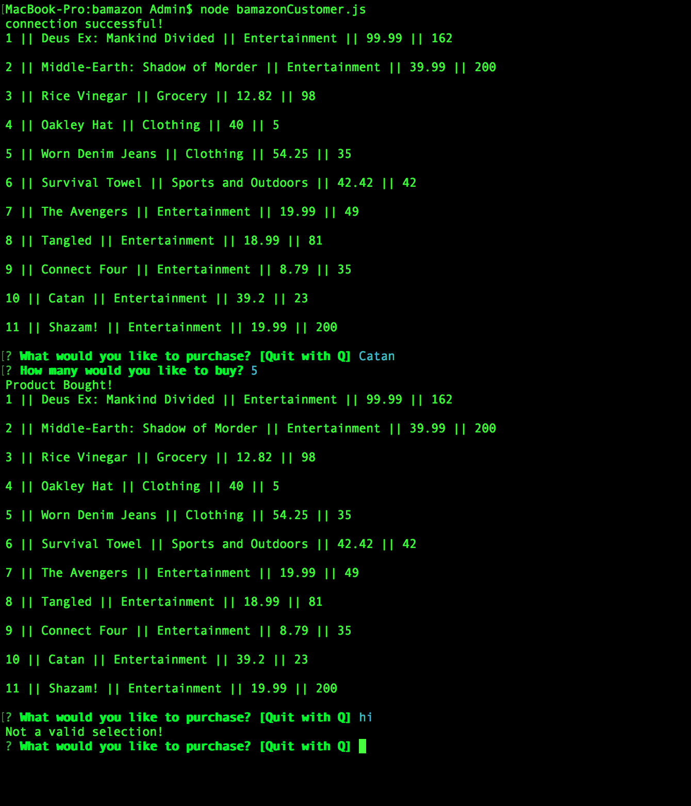
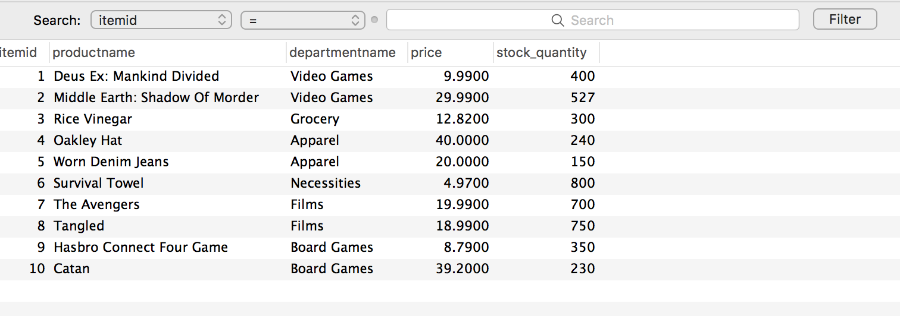

# Bamazon

### Bamazon Assignment
 
 Bamazon is a Amazon-like store front using Node.js and MySQL.
 
 ### What Each Javascript file does
 
 1. bamazonCustomer.js
 - Prints the products in the store
- Prompts the customer to purchase an item

2. bamazonManager.js
- Starts with a menu
  - View Products for Sale
  - View Low Inventory
  - Add to Inventory
  - Add New Product
  - End Session
- If the manager selects View Products for Sale, it lists all of the products in the store including all of their details.
- If the manager selects View Low Inventory, it'll list all the products with less than five items in its StockQuantity column.
- If the manager selects Add to Inventory, it allows the manager to select a product and add inventory.
- If the manager selects Add New Product, it allows the manager to add a new product to the store.
- If the manager selects End Session, it ends the session and doesn't go back to the menu.

 ### Node.js
 MySQL NPM Package - https://www.npmjs.com/package/twitter
 Inquirer NPM Package - https://www.npmjs.com/package/spotify
 

### Built With
Visual Studio - Text Editor

 
 
